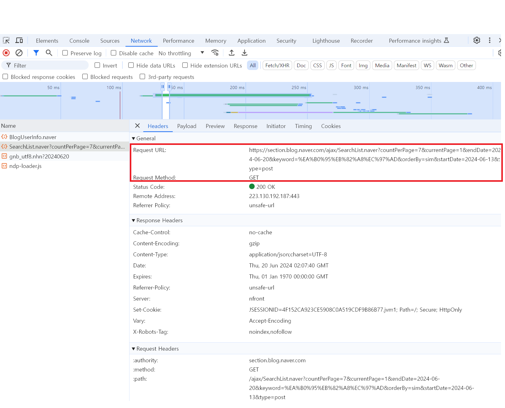

# 🧊 오류/문제 해결
## Naver crawling 작업 시간 이슈

### ❓ 문제 상황
### Naver blog url 수집 작업 약 2.5시간, Hash tag 수집 작업 약 2일 이상 소요
* 발생한 이슈 : naver crawling 작업 시간이 과도하게 길어지면 데이터 조회 및 반영 기간을 길게 설정하게 되기 때문에 시의성이 떨어져 데이터가 가지는 유의미성이 훼손되므로 crawling 작업 시간 단축이 필요
<br><br>

---

### 💭 원인 추론
HeadLess를 적용하고 Web Driver의 숫자를 줄이더라도 실행 시간을 줄이는데 한계가 있고, Selenium은 자바스크립트가 로드된 후 사용자가 사용할 수 있기 때문에 이 부분에서 큰 비용이 발생할 수밖에 없는 구조였다. 하지만 내게 필요한 데이터는 Rendering된 결과가 아닌 해당 페이지의 HTML_Source였기 때문에 Rendering이 끝날 때까지 기다릴 필요가 없었다.


한 페이지당 Rendering이 완료될 때까지 시간은 대략 400ms로 대략적인 전체 크롤링 시간을 계산하면 300(pages) * 115(keyword 개수) * 400ms = 13,800,000 ms 가 소요된다. 다른 작업이 완료되지 않고 Crawling 대상 페이지에만 소요되는 최소 시간이 230분 소요되는데 여기에 다른 작업까지 추가 되어 동기처리 되니 소요되는 시간은 급격하게 높아졌던 거다.<br><br>

---

### ❗️ 해결 방법
### 트러블 해소과정 ① : Naver blog url을 받아오는 방식을 selenuium에서 Ajax requests로 변경

> **Ajax(Asynchronous javascript and XML)** <br>
자바스크립트를 이용하여 비동기적으로 서버와 브라우저가 데이터를 교환하는 통신 방식으로 브라우저는 Ajax request를 통해 동적인 부분을 요청하고 서버는 json을 통해 reload하는데 필요한 정보들을 반환함.

<br>

개발자 도구 > [Network] 탭 > 서버의 response 목록들을 확인 > preview로 가지고 있는 데이터 확인 > Request URL을 확인하고 해당 URL에 접근

<p align="center">
  
</p><br><br>

Request URL에 맞게 쿼리문을 보내 받아온 json 데이터를 parsing하도록 코드를 수정하여 작업 시간이 37분으로 줄어들었다.

```python

def blogdata_crawling():
    keywords = get_keywords()
    blog_data = []

    # keyword별 for문
    for keyword in keywords:
        encoded_keyword = quote(keyword)
        page_num = 1
        start_date, end_date = set_datetime()

        referer = f"https://section.blog.naver.com/Search/Post.naver?pageNo={page_num}&rangeType=WEEK&orderBy=sim&startDate={start_date}&endDate={end_date}&keyword={encoded_keyword}"
        headers = {
          "User-Agent": "Mozilla/5.0 (Windows NT 10.0; Win64; x64) AppleWebKit/537.36 (KHTML, like Gecko) Chrome/125.0.0.0 Safari/537.36",
          "referer": referer
        }
        url = set_search_url(page_num,end_date,keyword,start_date)
        response = requests.get(url, headers=headers)
        response.raise_for_status()   # status_code가 200이 아닌 경우 exception 발생 시켜줌
        response_data = json.loads(response.text.strip()[6:])
        total_count = response_data['result']['totalCount']
        total_page = (total_count//7)+1
        print(f'{keyword}:total_page - {total_page}')
        max_page = 300
        ...

```
<br><br>


### 트러블 해소과정 ② : hash tag 수집 시 조건 설정
hash tag data는 최종 rendering 된 결과에 포함되어 있어 selenium을 이용할 수밖에 없었기에 tag 수집시 조건을 걸어 불필요한 작업을 제외시켰다.

```python
  try:
      driver.get(blog_url)
      # iframe 접근
      WebDriverWait(driver, 10).until(EC.frame_to_be_available_and_switch_to_it((By.ID, 'mainFrame')))

      # 태그 찾아서 가져오기
      tags_element = driver.find_element(By.CLASS_NAME, "wrap_tag")
      tags_text = tags_element.text

      # 정규 표현식을 사용하여 '태그', '#', '역' 제거
      tags_text = re.sub(r'(태그|#|역)', '', tags_text).replace(keyword, "").strip()
      tags = [tag.strip() for tag in tags_text.split("\n") if tag.strip()]

      # 제외할 단어가 포함된 태그가 있는지 확인
      if any(tag in exclude_list for tag in tags):
          continue
      # if not any(exclude in tag for exclude in exclude_list):
      #     continue

      # 데이터 저장
      if tags:
          crawling_contents_data.append({"location": keyword, "tags": tags})
          total_tags += len(tags)
          logging.info(f'{index}번째 완료: {tags} / 총 {total_tags} 개')
          # 해시태그 개수가 200개 이상이면 다음 키워드로 넘어가기
          if total_tags >= 200:
              break

  except Exception as e:
      logging.error(f"error ({index}) : {str(e)}")

```
<br><br>

### 트러블 해소과정 ③ : 멀티스레딩(Multi-threading) 활용
blog url에 방문하여 hash tags를 수집하는 작업에 멀티스레딩을 활용하여 동시에 여러 개를 진행할 수 있도록 만들어 크롤링 속도를 높일 수 있었다. (concurrent.futures 모듈의 ThreadPoolExecutor를 사용)

``` python
def tags_crawling_parallel(file_name):
    # URL 리스트 가져오기
    crawling_data = pd.read_csv(file_name)
    # 위치 리스트 가져오기
    keywords = get_keywords()
    # 제외할 단어 리스트 가져오기
    exclude_list = [exclude_word.strip() for exclude_word in pd.read_csv('data/exclude_list.csv')]

    crawling_contents_data = []

    # 병렬 처리를 위한 ThreadPoolExecutor
    with concurrent.futures.ThreadPoolExecutor(max_workers=5) as executor:
        # 각 위치 키워드에 대해 병렬로 크롤링 작업 실행
        future_to_keyword = {executor.submit(crawl_tags, keyword, crawling_data, exclude_list): keyword for keyword in keywords}
        for future in concurrent.futures.as_completed(future_to_keyword):
            keyword = future_to_keyword[future]
            try:
                result = future.result()
                crawling_contents_data.extend(result)
            except Exception as e:
                logging.error(f"Exception occurred for keyword '{keyword}': {str(e)}")

    return crawling_contents_data

```
<br>

---

### ✅ 결과

이러한 전략들을 통해 크롤링 작업의 효율성과 속도를 높여 총 작업 시간을 2시간 이내로 줄일 수 있었고, 향후 다른 데이터 수집 및 처리 작업에서도 활용할 수 있을 것 같다.