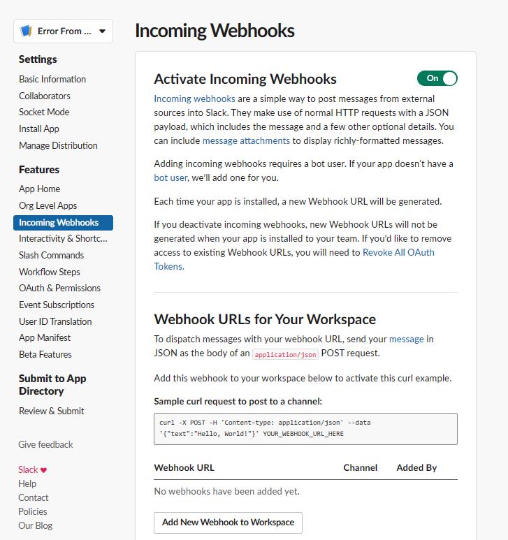
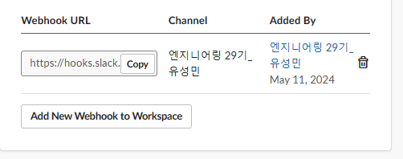
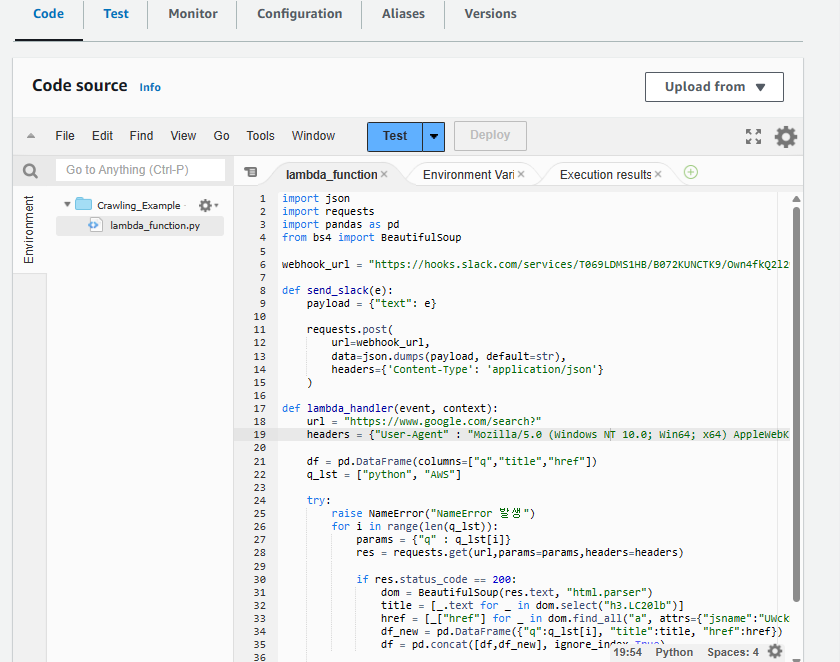
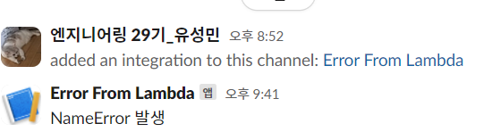

# 🧊 오류/문제 해결
## 데이터 수집시 exception 발생

### ❓ 문제 상황
### OPEN API를 이용하여 서울시 공공데이터 수집시 일부 데이터 누락
* 발생한 이슈 : 서울시 공공 데이터 수집시 데이터 일부가 누락되어 손실이 발생하므로 Excepiton 발생에 대한 트래킹이 필요
---

### 💭 원인 추론
서버 점검시간, 회당 호출 가능 횟수 제한, 메모리 소진, 일시적 호출 제한 등으로 일부 데이터에 대한 응답이 누락되었다.

---

### ❗️ 해결 방법
### 트러블 해소과정 : Exceptopn 발생시 slack으로 알람 받기
(성민님이 내용 추가할 예정)
Activate Incoming Webhooks - On & Add New Webhook to Workspace

  

 

Webhook URL을 복사하여

  

 
Lamda에서 lambda_function.py에 코드 추가

  

  

### ✅ 결과
Exception이 발생할 때마다 slack으로 알람을 받아 어느 시점에 어떤 에러가 발생하였는지 트래킹 할 수 있게 되었고 Exception 관리를 더 효율적으로 할 수 있게 되었다.

  

  