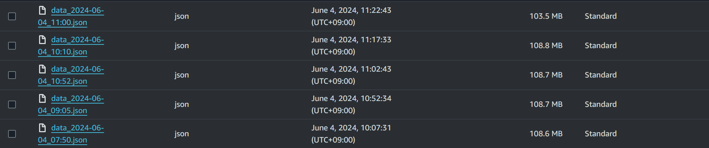
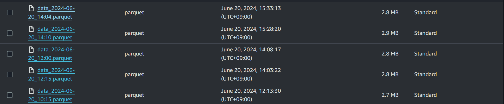

# 🧊 오류/문제 해결
## 모델링 이슈

### ❓ 문제 상황
### 예측 성능이 좋지 않음
* 발생한 이슈 : `Prophet` 모델을 쓴 결과가 좋지 않았음 (몇% 성능)
<br><br>

---

### ❗️ 해결 방법
### 트러블 해소과정 : 데이터 정제

> **Grouping**
<br>  
데이터가 5분 단위로 수집되어 시간 단위의 예측을 하는데 큰 효과를 미치지 않음
<br>

5분 단위의 데이터를 시간별 그룹화를 통해 데이터를 줄였음 (몇만건 -> 줄인 갯수)

```py

```
<br><br>

---

### ✅ 결과
대용량 데이터(65,000건)를 json 대신 parquet 형태로 저장함으로써 각 데이터의 용량을 110 MB에서 2.8 MB로, 데이터를 읽어오는 시간을 20초에서 0.5초로 줄여 리소스를 효율적으로 활용할 수 있게 되었다.

<p align="center">
  
</p>
<p align="center">
  
</p><br><br>
